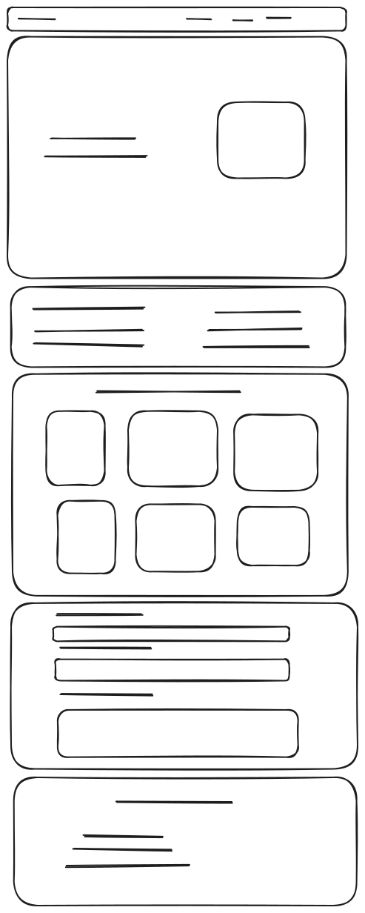

# Portafolio hecho con HTML Y CSS

## CODER

### Nombre: **Emmanuel Rendon Goez**

### Clan: **Ritchie**

## Correo electrónico: **emarendon1301@gmail.com**

## Cédula **1001250755**

## Contenido

Este documento muestra el diseño del portafolio y sus diferentes contenidos

## Maquetado

### Header

En el header del portafolio podemos encontrar una barra de navegación que contiene links,
estos links redirigen a las diferentes direcciones de la página.

Este nav-bar se moverá junto con la pantalla para así a pesar de estar en el pie de página,
se podrá acceder a la barra de navegación

### Main

El main se divide en cuatro partes

- **PARTE PRINCIPAL**
- **ACERCA DE MI**
- **PROYECTOS**
- **FORMULARIO DE CONTACTO**

#### La parte principal 

Esta contiene una sección con mi nombre, a lo que me dedico y una imágen representativa.

#### Acerca de mi

Esta contiene una sección con información personal y habilidades que poseo.

#### Proyectos

Esta parte contiene una sección con mis proyectos, y cartas que muestran una imagen y la información de cada
proyecto

#### Formulario de contacto

Esta parte contiene una sección con un formulario de contactos con campos de nombre, correo y un mensaje.

### Footer

El pie de página contiene una sección de información acerca de mi
